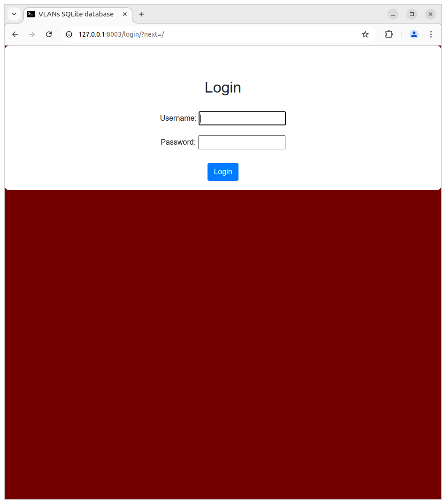
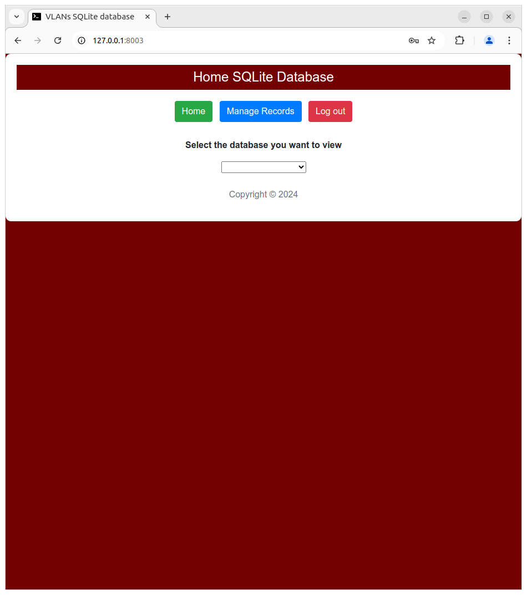
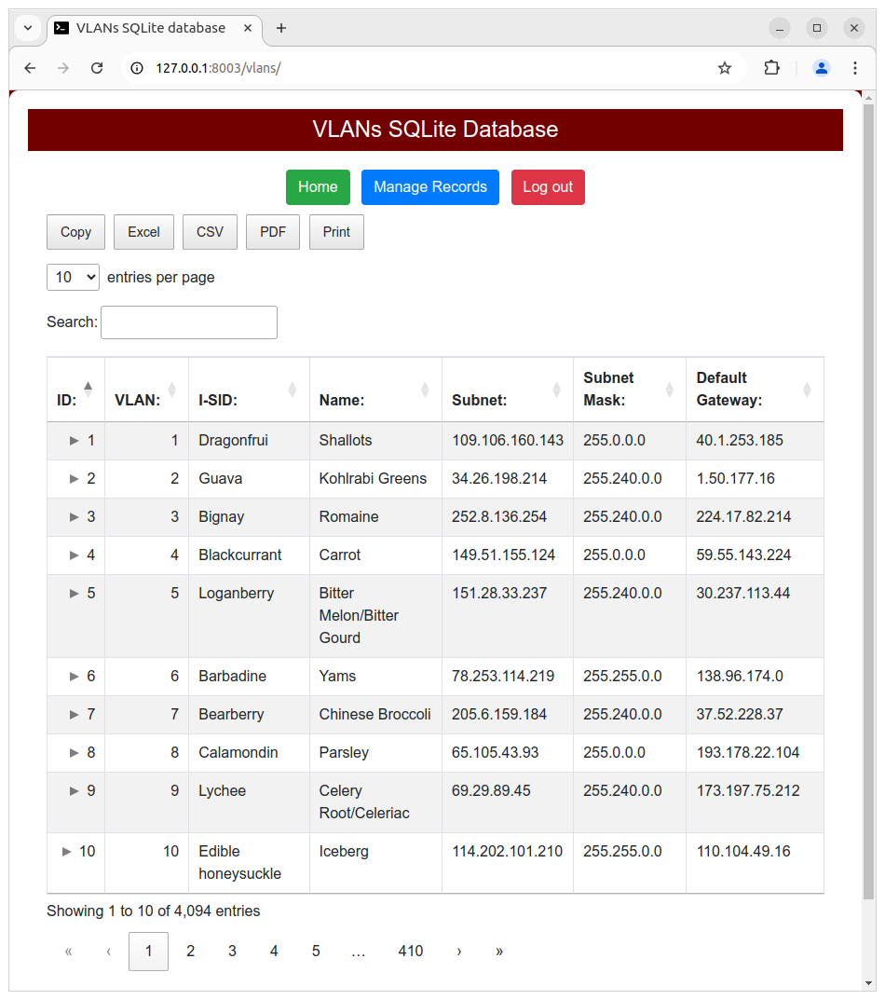
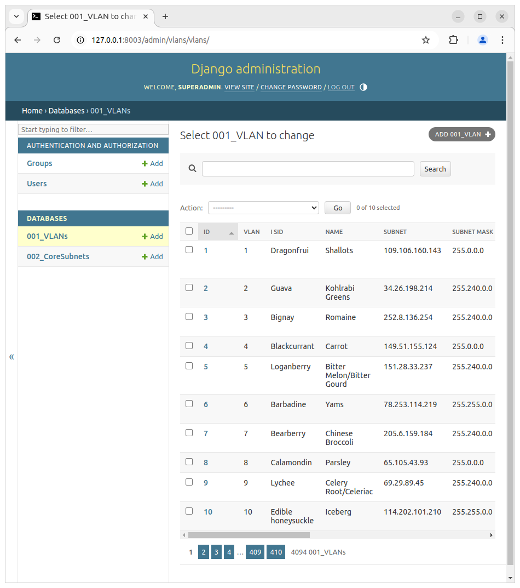

# Django REST Framework Datatables Project

## Overview
This free and open-source project showcases the integration of the Django REST Framework with Datatables. It provides read-only data tables and a complete data management system with (create, read, update, and delete) operations with the Django admin web interface.

## Requirements
- git
- python3

## Ubuntu packages

1. **Install the required Ubuntu apt packages:**

    ```bash
    sudo apt update && sudo apt install git python3 python3-dev python3-venv -y
    ```

## Installation

1. **Use git to clone the repository into your current working directory**

    ```bash
    git clone https://github.com/LinuxSystemsEngineer/django_rest_framework_datatables_project.git
    ```
2. **Change directories to the newly cloned github repository:**

    ```bash
    cd django_rest_framework_datatables_project
    ```

3. **Create an isolated Python virtual environment:**

    ```bash
    python3 -m venv .venv
    ```

4. **Activate the newly created Python virtual environment:**

    ```bash
    . .venv/bin/activate
    ```

5. **Install required packages from the `requirements.txt` file:**

    ```bash
    pip3 install -r requirements.txt
    ```

6. **Make the database migrations:**

    ```bash
    python3 manage.py makemigrations
    ```

7. **Migrate the database and create the `db.sqlite3`:**

    ```bash
    python3 manage.py migrate
    ```

8. **Create a Python Django admin account and password:**

    ```bash
    python3 manage.py createsuperuser
    ```

9. **Create obfuscated data for the vlans database:**

    ```bash
    python3 ./create_db_vlans_vlans.py 
    ```

10. **Create obfuscated data for the coresubnets database:**

    ```bash
    python3 ./create_db_coresubnets.py
    ```

11. **Run the Django web framework app on port 8007:**

    ```bash
    python3 manage.py runserver 0.0.0.0:8007
    ```

12. **Access the Django web interface through your web browser:**

    ```bash
    with a web browser, navigate to 127.0.0.1:8007
    ```

## Usage

- **Read-only Datatables:**

    Access the read-only data tables at [http://hostserveripaddress:8007](http://hostserveripaddress:8007).

- **Data Management Operations:**

    For data management operations, go to [http://hostserveripaddress:8007/admin](http://hostserveripaddress:8007/admin) and log in with the username and password you created.

## Features

- Multi-column sorting
- Pagination
- Search functionality
- Export options (Excel, CSV, PDF, Print)
- Record mangement
- Mobile responsive design

## Programmer
 **Blake Jones** built this project. For any questions or further information, you can contact me on LinkedIn.

* https://www.linkedin.com/in/blake-jones-linux/

## Contributions
Feel free to fork out this project and submit pull requests. For significant changes, please open an issue first to discuss what you want to change.

## Sources / References
This project's code is from:

* https://django-rest-framework-datatables.readthedocs.io/en/latest/tutorial.html.

* https://datatables.net/

* https://www.w3schools.com/

* https://mimesis.name/master/

## Screenshots

- **Login Page:**


- **Landing Page:**


- **VLANs Datatables Page:**


- **Manage Records / Data Management (create, read, update, delete) Page:**


